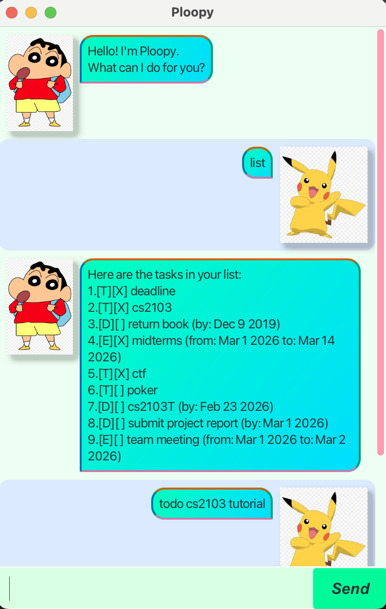

# Ploopy User Guide

Ploopy is a **desktop chatbot task manager** that helps you keep track of:

- **To-dos** (simple tasks)
- **Deadlines** (tasks with due dates/times)
- **Events** (tasks with start/end times)

You interact with Ploopy through a **GUI chat window** by typing commands into the input box. Ploopy replies in a conversational format and updates your task list.

---

## Table of Contents

- [Quick Start](#quick-start)
- [Interface Overview](#interface-overview)
- [Command Format](#command-format)
- [Features](#features)
    - [View Welcome Message](#view-welcome-message)
    - [Add a To-do Task](#add-a-to-do-task)
    - [Add a Deadline](#add-a-deadline)
    - [Add an Event](#add-an-event)
    - [List All Items](#list-all-items)
    - [Mark an Item as Done](#mark-an-item-as-done)
    - [Unmark an Item](#unmark-an-item)
    - [Delete an Item](#delete-an-item)
    - [Find Items (if supported)](#find-items-if-supported)
    - [Exit Ploopy](#exit-ploopy)
- [Command Summary](#command-summary)
- [FAQ](#faq)
- [Troubleshooting](#troubleshooting)

---

## Quick Start

### Prerequisites

- **Java 17** (recommended) installed on your computer

> You can check your Java version with:
>
> ```bash
> java -version
> ```

### Running Ploopy from the JAR file

1. Download the Ploopy JAR file.
2. Open a terminal.
3. Navigate to the folder containing the JAR file.
4. Run the following command:

```bash
java -jar ploopy.jar
```

### First Launch

When Ploopy starts, it will display a **welcome message** in the chat window.

---

## Interface Overview

Ploopy uses a graphical chat interface with the following parts:

- **Chat display area**: shows the conversation between you and Ploopy
- **Input box**: where you type commands
- **Send button**: sends your command to Ploopy

You can also press **Enter** to send your command.

### Example UI

<!-- Replace with your actual screenshot path -->


---

## Command Format

Commands are typed into the input box in the chat window.

### Notation used in this guide

- `KEYWORD` = command word (e.g., `todo`, `list`, `bye`)
- `DESCRIPTION` = description of the task/event
- `INDEX` = number of an item shown in the list
- `DATE_TIME` = due date/time text entered by the user
- `START_TIME`, `END_TIME` = event start/end time text entered by the user

### Notes

- Commands are generally typed in **lowercase** (recommended).
- Some commands require specific separators:
    - `deadline ... /by ...`
    - `event ... /from ... /to ...`
- If a command format is invalid, Ploopy will show an error message.

---

## Features

## View Welcome Message

When Ploopy starts, it displays a greeting in the chat window.

### Expected Result

Ploopy shows a welcome message, for example:

```text
Hello! I'm Ploopy. How can I help you today?
```

---

## Add a To-do Task

Adds a task with no date or time.

### Command

```text
todo DESCRIPTION
```

### Example

```text
todo revise database notes
```

### Expected Result

Ploopy confirms the task was added and shows it in the task list.

---

## Add a Deadline

Adds a task with a due date.

### Command

```text
deadline DESCRIPTION /by DATE(YYYY-MM-DD)
```

### Example

```text
deadline submit project report /by 2026-03-01
```

### Expected Result

Ploopy confirms the deadline was added and shows the due date/time.

---

## Add an Event

Adds a task with a start and end time.

### Command

```text
event DESCRIPTION /from START_DATE /to END_DATE
```

### Example

```text
event team meeting /from 2026-03-01 /to 2026-03-02
```

### Expected Result

Ploopy confirms the event was added and shows the event timing.

---

## List All Items

Displays all tasks, deadlines, and events currently stored.

### Command

```text
list
```

### Example

```text
list
```

### Expected Result

Ploopy shows a numbered list of all items.

---

## Mark an Item as Done

Marks an item as completed.

### Command

```text
mark INDEX
```

### Example

```text
mark 2
```

### Expected Result

Ploopy marks item `2` as done.

---

## Unmark an Item

Marks a completed item as not done.

### Command

```text
unmark INDEX
```

### Example

```text
unmark 2
```

### Expected Result

Ploopy marks item `2` as not done.

---

## Delete an Item

Deletes an item from the list.

### Command

```text
delete INDEX
```

### Example

```text
delete 3
```

### Expected Result

Ploopy removes item `3` and confirms the deletion.

---

## Find Items

Searches for items that contain a keyword.

### Command

```text
find KEYWORD
```

### Example

```text
find report
```

### Expected Result

Ploopy displays the items that match the keyword.

---

## Exit Ploopy

Closes the application.

### Command

```text
bye
```

### Expected Result

Ploopy displays a goodbye message and closes the app shortly after.

---

## Command Summary

| Action | Command Format                                    |
|---|---------------------------------------------------|
| Add to-do | `todo DESCRIPTION`                                |
| Add deadline | `deadline DESCRIPTION /by DATE`                   |
| Add event | `event DESCRIPTION /from START_DATE /to END_DATE` |
| List all items | `list`                                            |
| Mark item as done | `mark INDEX`                                      |
| Unmark item | `unmark INDEX`                                    |
| Delete item | `delete INDEX`                                    |
| Find items | `find KEYWORD`                                    |
| Exit app | `bye`                                             |

---

## FAQ

### How do I run Ploopy?

Run the JAR file from a terminal:

```bash
java -jar ploopy.jar
```

---

### Do I need to use the mouse?

No. You can type in the input box and press **Enter** to send commands.

---

### What happens when I type `bye`?

Ploopy will show a goodbye message and then close the application.

---

### Are my tasks saved after I close the app?

Yes, tasks will be loaded again on the next launch.

---

## Troubleshooting

### The app does not open

- Check that Java is installed:
  ```bash
  java -version
  ```
- Make sure you are in the correct folder before running:
  ```bash
  java -jar ploopy.jar
  ```

---

### A command does not work

- Check the spelling of the command (`todo`, `deadline`, `event`, etc.)
- Check that required separators are included:
    - `deadline ... /by ...`
    - `event ... /from ... /to ...`
- Check that your dates are in the correct format(YYYY-MM-DD)

---

### The GUI opens, but I get an error when sending commands

This usually means there is an issue with command format or parsing.

Try:
- `list`
- `todo test`
- `bye`

to verify that the app is responding correctly.

---

## Notes for Users

- Use `list` to check item numbers before `mark`, `unmark`, or `delete`.
- Use clear descriptions to keep your task list easy to read.
- Keep command formats consistent for best results.
- Duplicate items are not allowed.

---

## Acknowledgements

Ploopy is a Java-based chatbot application with a GUI interface, designed to help users manage tasks, deadlines, and events efficiently.